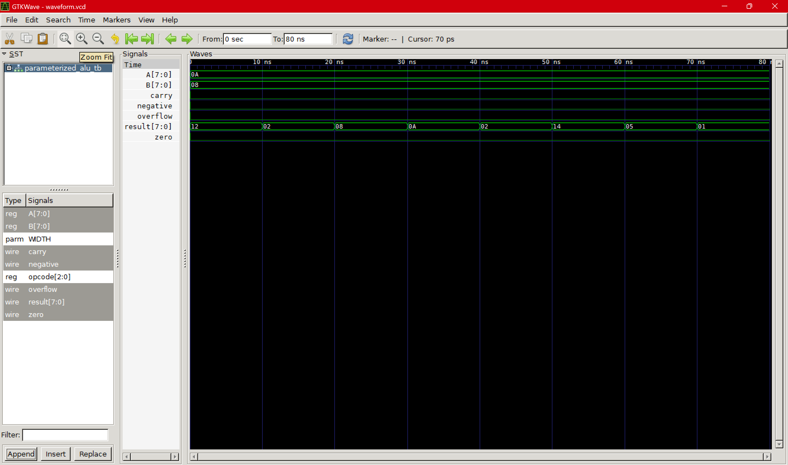

# Parameterized ALU Design using Verilog

## Overview

This project implements a parameterized Arithmetic Logic Unit (ALU) using Verilog HDL.

The ALU supports arithmetic, logical, shift and comparison operations with configurable data width.

## Features

- Parameterized data width
- Addition
- Subtraction
- AND
- OR
- XOR
- Left shift
- Right shift
- Comparison

## Status Flags

The ALU generates:

- Carry flag
- Zero flag
- Overflow flag
- Negative flag

## Design Approach

- RTL modeling using Verilog
- Combinational logic design
- Opcode-based operation selection

## Tools Used

- Verilog HDL
- Icarus Verilog
- GTKWave

## Opcode Table

| Opcode | Operation |
|---|---|
|000|ADD|
|001|SUB|
|010|AND|
|011|OR|
|100|XOR|
|101|LEFT SHIFT|
|110|RIGHT SHIFT|
|111|COMPARE|

## Verification

The design was verified using a Verilog testbench and waveform analysis using GTKWave.

## Simulation Waveform

